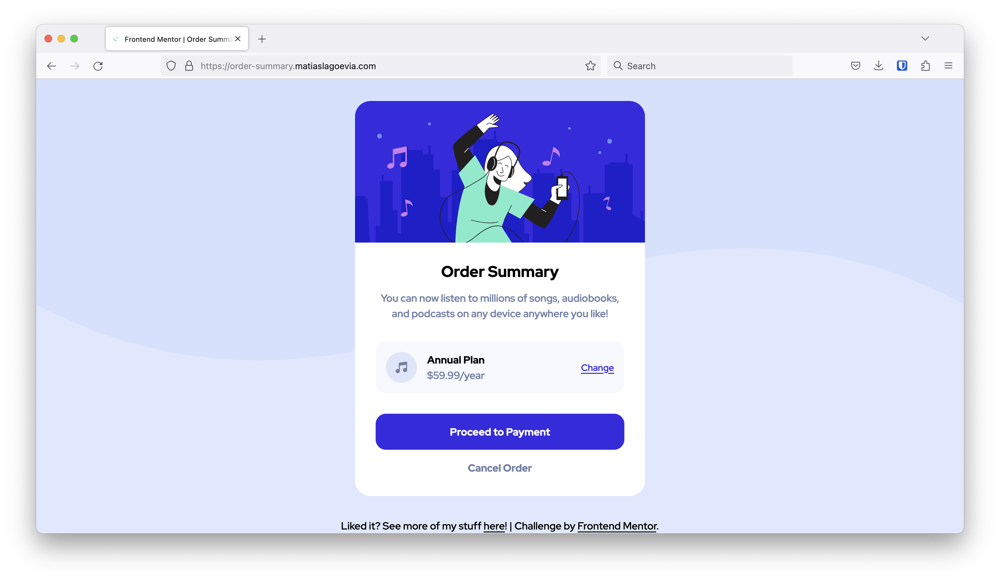

# Frontend Mentor - Order summary card solution

This is a solution to the [Order summary card challenge on Frontend Mentor](https://www.frontendmentor.io/challenges/order-summary-component-QlPmajDUj). Frontend Mentor challenges help you improve your coding skills by building realistic projects.

## Table of contents

- [Overview](#overview)
  - [The challenge](#the-challenge)
  - [Screenshot](#screenshot)
  - [Links](#links)
- [My process](#my-process)
  - [Built with](#built-with)
  - [What I learned](#what-i-learned)
  - [Continued development](#continued-development)
  - [Useful resources](#useful-resources)
- [Author](#author)
- [Acknowledgments](#acknowledgments)

## Overview

### The challenge

Users should be able to:

- See hover states for interactive elements

### Screenshot

### Links

- Solution URL: [https://www.frontendmentor.io/solutions/responsive-order-summary-component-using-bem-O9kCAfvuff](https://www.frontendmentor.io/solutions/responsive-order-summary-component-using-bem-O9kCAfvuff)
- Live Site URL: [https://order-summary.matiaslagoevia.com](https://order-summary.matiaslagoevia.com)

## My process

### Built with

- Semantic HTML5 markup
- Flexbox
- Mobile-first workflow
- BEM

### What I learned

**Mobile vs Desktop Repeating Background Image**
Learning about repeat-x, manually finding where the background would break, and then using a media query to seamlessly switch to the desktop version of the background pattern.

**Background Image and Color combination**
At first I thought this was a SVG pattern or something for the background, but then realized that it was possible to combine the pattern image with a color in a creative and pleasing way.

**Mobile-First Workflow**
Really helped to avoid unnecessarily complicating the CSS and layout. Almost no adjustments were necessary to accommodate for a responsive design this way.

**BEM structure diagram before implementing solution**
Similar to the mobile-first workflow, this helped to have a clear idea of how I'd implement the solution before actually doing so. This helped to work with a purpose and arrive at a cleaner, faster solution.

### Continued development

**HTML and CSS learning paths**
I want to continue expanding my fundamentals as I work on the challenges. I've found a good balance for now of reading about chapters, applying the examples within the reference material, and then solidifying it through Frontend Mentor challenges like this one.

**BEM**
I want to continue developing my intuition and experience with BEM. I've found it to be an incredibly useful mental model and I look forward to continue to use and learn from it!

**Implement actual plan selection/form logic**
This will come with later challenges, though it's something I look forward to. It would be interesting to implement the actual logic and behavior for a system like this, not just the appearance/styles. Still, happy with how this version turned out!

### Useful resources

- [**MDN background image/repeat**](https://developer.mozilla.org/en-US/docs/Web/CSS/background-image) -> `background-image` property MDN reference.
- [**HTML and CSS learning paths**](https://web.dev/learn) -> supporting materials to continue to learn more about HTML/CSS fundamentals.
- [**BEM website**](https://getbem.com/) -> BEM's official reference/docs.
- [**BEM video tutorial**](https://www.youtube.com/watch?v=N1TYlM0GA5E) -> ByteGrad's video on BEM, it's motivation, and some examples.
- [**BEM breakdown discord help thread**](https://discord.com/channels/824970620529279006/1187555469565374524) -> Grace's review and thoughts on my BEM diagram breakdown of the problem.

## Author

- Website - [https://matiaslagoevia.com](https://matiaslagoevia.com)
- Frontend Mentor - [@matiaslagoevia](https://www.frontendmentor.io/profile/matiaslagoevia)

## Acknowledgments

Thank you `@gracesnow` for your review and advice on my BEM diagram breakdown of the problem! It was incredibly helpful and included good advice for me to continue growing in the future.
